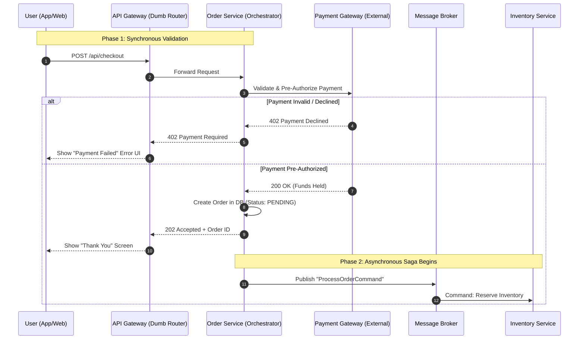

In a microservice architecture, one of the biggest headaches is managing transactions that span multiple services. Since each service has its own database, you can't use a traditional "ACID" transaction to lock everything down at once.

The **Saga Pattern** is the solution to this. It manages data consistency across microservices by breaking a large, distributed transaction into a sequence of smaller, local transactions.

---

## How it Works

A Saga is a sequence of local transactions. Each local transaction updates the database and triggers the next step. If one step fails, the Saga executes **compensating transactions** to undo the changes made by the preceding steps.

## 1. Choreography (Event-based)

In this approach, there is no central "boss." Each service works independently and broadcasts events.

- **Process:** Service A completes its task and publishes an "A-Done" event. Service B listens for that event, does its job, and publishes "B-Done."
    
- **Pros:** Simple for small workflows; no single point of failure.
    
- **Cons:** Hard to track as the number of services grows; can become a "spaghetti" of events.
    

## 2. Orchestration (Command-based)

Here, a central **Orchestrator** (the "brain") tells each service what to do and when.

- **Process:** The Orchestrator sends a command to Service A (asynchronously through events). Once A confirms, the Orchestrator (again asynchronously through events / queues) sends a command to Service B.
    
- **Pros:** Easier to manage complex workflows; clear state management.
    
- **Cons:** The Orchestrator can become a bottleneck or a single point of failure if not designed correctly.
    

---

## Handling Failure: Compensation

Since you can't "rollback" a database change that has already been committed in a microservice, you must perform a **Compensating Transaction**.

|**Action**|**Success Path**|**Failure (Compensating) Path**|
|---|---|---|
|**Order Service**|Create "Pending" Order|Mark Order as "Cancelled"|
|**Payment Service**|Charge Credit Card|Refund Credit Card|
|**Stock Service**|Reserve Items|Return Items to Inventory|

> **Note:** A compensating transaction doesn't literally "erase" the past; it creates a new state that offsets the previous one (like a refund offsets a charge).

---

## When to use it?

- When you need data consistency across multiple services without tightly coupling them.
    
- When you have long-running transactions that shouldn't block other users.
    
- **Avoid it** if your system is simple enough to live within a single monolithic database, as Sagas add significant debugging complexity.

# Example of SAGA pattern

Here is a practical example using a **Travel Booking System** (booking a flight, a hotel, and a rental car). We'll use the **Orchestration** approach with a central "Travel Orchestrator" managing the asynchronous messages.

This sequence diagram illustrates a scenario where the flight and hotel book successfully, but the rental car fails, triggering the **compensation phase** to roll back the previous successful steps.

Code snippet

```mermaid
sequenceDiagram
    autonumber
    participant C as Client
    participant O as Travel Orchestrator
    participant F as Flight Service
    participant H as Hotel Service
    participant R as Car Service

    C->>O: Submit Travel Request
    
    Note over O,F: Happy Path Begins
    O->>F: Command: Book Flight
    F-->>O: Event: Flight Booked Successfully
    
    O->>H: Command: Book Hotel
    H-->>O: Event: Hotel Booked Successfully
    
    O->>R: Command: Book Rental Car
    R-->>O: Event: Car Booking FAILED (Out of stock)

    rect rgb(60, 10, 10)
        Note over O,R: Compensation Phase (Rollback)
        O->>H: Command: Cancel Hotel Reservation
        H-->>O: Event: Hotel Cancelled
        
        O->>F: Command: Cancel Flight Ticket
        F-->>O: Event: Flight Cancelled
    end

    O-->>C: Response: Booking Failed (All charges refunded)
```

## Breaking Down the Flow

1. **The Trigger:** The client submits a request to the Orchestrator. In a real system, the Orchestrator instantly replies with a `202 Accepted` and a `tracking_id`, while the actual processing happens in the background.
    
2. **The Forward Execution:** The Orchestrator fires off a message to the Flight Service queue. The Flight Service does its database work and drops a success message back. The Orchestrator hears this and moves to the Hotel Service.
    
3. **The Failure:** The Hotel books fine, but the Car Service reports a failure (e.g., no cars available for those dates).
    
4. **The Compensation:** The Orchestrator stops moving forward. It looks at its internal state machine, sees that the Flight and Hotel were already booked, and begins issuing specific compensation commands in reverse order. It tells the Hotel to cancel, waits for confirmation, and then tells the Flight to cancel.
    

## Why this matters

Notice that the Orchestrator doesn't just issue a global `ROLLBACK` command to a database. It explicitly commands the other microservices to execute their own local business logic to undo the previous actions.

Would you like to see how you might structure the actual Python/FastAPI code for one of these local service workers to listen for these commands and emit events?

# CQES in  e-commerce apps like amazon and flipkart.

In massive e-commerce platforms like Amazon or Flipkart, the checkout process is a textbook example of handling complex Sagas at an extreme scale. They prioritize **user experience (speed)** and **high availability** over immediate, strict database consistency.

They use a hybrid approach that relies heavily on **Eventual Consistency**. However, dealing with payments requires a careful balance between that speed and financial security.

Here is the complete, start-to-finish breakdown of how the communication and workflow are handled, including exactly what happens when payments are validated and what happens if they fail.

---

## Phase 1: The Illusion of Speed & Initial Validation (Synchronous)

When you click the "Place Order" button, the app does _not_ wait for the entire fulfillment process to finish. However, it **does** perform critical, fast validations—including the initial payment check—while you are looking at the loading spinner.

1. **Basic Validation:** The API checks if you are logged in, if the cart has items, and if the delivery address is serviceable.
    
2. **Payment Pre-Authorization (The Phase 1 Payment Check):** The system makes a rapid, synchronous call to the Payment Gateway (like Stripe or Razorpay) to validate the card details and perform a "Pre-Authorization." It asks the bank: _"Does this card have enough funds, and is it valid?"_ It does **not** actually capture the money yet; it just puts a hold on it.
    
3. **Handling Phase 1 Failure:** * If the bank immediately declines the card (e.g., incorrect CVV, expired card, insufficient funds), the synchronous request fails.
    
    - **Result:** The server returns an HTTP `400 Bad Request` or `402 Payment Required`. The UI instantly drops the loading spinner and shows a red error message: _"Payment declined. Please try a different method."_ **The Saga never begins, and no order is created.**
        
4. **Initial State (If Successful):** If the pre-authorization succeeds, the system creates an Order record in the primary database with a status of **"PENDING"** or **"RECEIVED"**.
    
5. **Immediate Response:** The server immediately returns an HTTP `200 OK` or `202 Accepted` to your browser, along with your Order ID, and routes you to the "Thank You for Your Order!" page.
    

_At this exact moment, your order is accepted, but the complex background work is just beginning.

## Phase 2: The Background Saga (Asynchronous)

Behind the scenes, the Order Service drops an "Order Created" event into a massive message broker (like Apache Kafka). This kicks off the Saga Orchestrator.

Over the next few seconds (or minutes), multiple microservices go to work:

- **Payment Service (Capture):** It reaches back out to the payment gateway to finalize the transaction and actually capture the pre-authorized funds.
    
- **Inventory Service:** Physically reserves the item in the nearest fulfillment center to prevent double-selling.
    
- **Fraud Service:** Analyzes the transaction for suspicious patterns.
    

**Handling Phase 2 Failure (The Compensation Path):**

What if the Phase 1 pre-authorization passed, but the actual payment _capture_ in Phase 2 fails (e.g., the bank's fraud system flags it 30 seconds later, or the UPI mandate times out)?

- The Orchestrator halts the forward progress of the Saga.
    
- It executes **compensating transactions**: It tells the Inventory Service to un-reserve the item.
    
- It changes the database state of the order from "PENDING" to **"PAYMENT_PENDING"** or **"ON_HOLD"** (Amazon rarely deletes the order entirely, as they still want your money!).
    

---

## Phase 3: Communicating the Final Result

Because the app already told you "Thank You" and you likely closed the app, the system uses a mix of **Push Notifications, Email,** and **Database Polling** to update you.

- **Success Path:** Once all background services complete successfully, the Orchestrator updates the database to "CONFIRMED". It tells the Notification Service to send you a Push Notification and an Email: _"Your order has been confirmed and is preparing for dispatch."_
    
- **Failure Path (If Phase 2 Payment Failed):** The Orchestrator triggers an urgent push notification and email: _"Action Required: Payment revision needed for your recent order."_ You click the link, and it takes you back to a checkout screen to enter a new card, which resumes the Saga.
    
- **The "My Orders" Page:** If you go to your "My Orders" page immediately after buying, the frontend is **polling** the database. It might say "Processing" for a minute before switching to "Confirmed" or "Action Required."
    

---

## The Architecture Visualized

Here is the flow mapping out both the Phase 1 immediate failure and the Phase 2 asynchronous processing.

Code snippet

## Why do they split payment into two steps (Pre-Auth vs. Capture)?

By only doing a fast "Pre-Authorization" in Phase 1, the checkout screen remains blazing fast and doesn't time out, but the business is still protected from obviously bad cards. The heavier logic (inventory routing, fraud checks, and actual fund capture) is safely moved to the background Saga.
