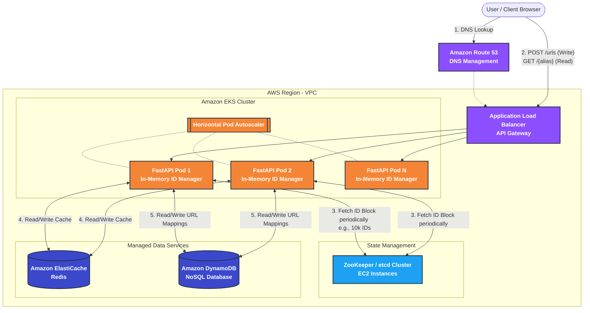

```mermaid
flowchart TD
    Client([User / Client Browser])
    DNS[Amazon Route 53<br/>DNS Management]

    subgraph AWS Cloud [AWS Region - VPC]
        
        ALB[Application Load Balancer<br/>API Gateway]

        subgraph Compute Tier [Amazon EKS Cluster]
            HPA[[Horizontal Pod Autoscaler]]
            App1[FastAPI Pod 1<br/>In-Memory ID Manager]
            App2[FastAPI Pod 2<br/>In-Memory ID Manager]
            AppN[FastAPI Pod N<br/>In-Memory ID Manager]
            
            HPA -.- App1 & App2 & AppN
        end

        subgraph Coordination Tier [State Management]
            ZK[ZooKeeper / etcd Cluster<br/>EC2 Instances]
        end

        subgraph Data & Caching Tier [Managed Data Services]
            Redis[(Amazon ElastiCache<br/>Redis)]
            Dynamo[(Amazon DynamoDB<br/>NoSQL Database)]
        end
    end

    %% Client Interactions
    Client -->|"1. DNS Lookup"| DNS
    DNS -.-> ALB
    Client -->|"2. POST /urls (Write) <br/> GET /{alias} (Read)"| ALB

    %% Load Balancing
    ALB --> App1
    ALB --> App2
    ALB --> AppN

    %% ID Generation Path (Write Path only)
    App1 <-->|"3. Fetch ID Block periodically <br/>e.g., 10k IDs"| ZK
    App2 <-->|"3. Fetch ID Block periodically"| ZK

    %% Cache Path (Read Heavy)
    App1 <-->|"4. Read/Write Cache"| Redis
    App2 <-->|"4. Read/Write Cache"| Redis

    %% Database Path
    App1 <-->|"5. Read/Write URL Mappings"| Dynamo
    App2 <-->|"5. Read/Write URL Mappings"| Dynamo

    %% Styling
    classDef aws fill:#FF9900,stroke:#232F3E,stroke-width:2px,color:black,font-weight:bold;
    classDef compute fill:#F58536,stroke:#232F3E,stroke-width:2px,color:white,font-weight:bold;
    classDef database fill:#3B48CC,stroke:#232F3E,stroke-width:2px,color:white,font-weight:bold;
    classDef network fill:#8C4FFF,stroke:#232F3E,stroke-width:2px,color:white,font-weight:bold;
    classDef state fill:#1DA1F2,stroke:#232F3E,stroke-width:2px,color:white,font-weight:bold;

    class DNS,ALB network;
    class App1,App2,AppN,HPA compute;
    class Redis,Dynamo database;
    class ZK state;
    
```

